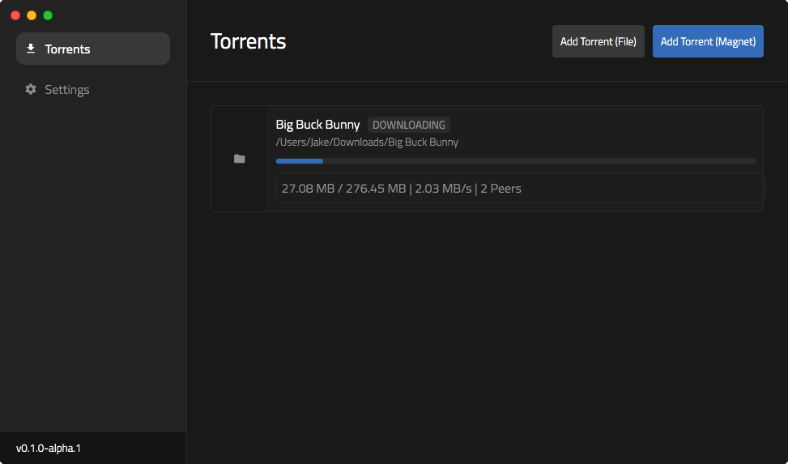

# Blitz

Blitz is a simple desktop torrent client for Windows and macOS.



### Building

To build Blitz, you'll need Node, NPM or Yarn, and the Vue CLI installed. You can run:
```
$ yarn electron:serve
```
to open the app in debug mode or run:
```
$ yarn electron:build
```
to build an executable.